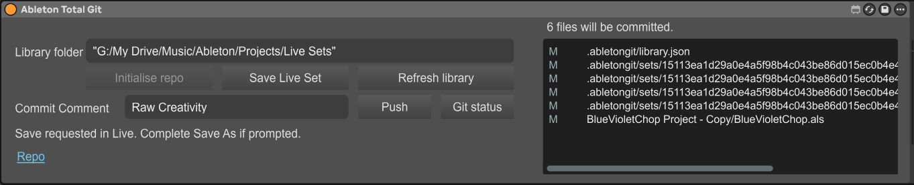

# Ableton Total Git

Keep a Git history of your Ableton projects without leaving Live. Ableton Total Git is a Max for Live device that shows which saved files have changed and lets you commit and push your library from your device chain.

Save your work, review the file list, add a comment about the moment, and press **Push**. Each commit gives you a named point in your library's history, so you can revisit earlier versions and follow how your music developed. Connect a GitHub repository to keep that history remotely, or keep your commits local.

## A history that fits your workflow

- **See what changed before committing.** The device lists changed files and shows how many will be committed. Saved changes refresh automatically while the device is visible.
- **Commit and upload with one button.** Push commits pending changes with your comment, then uploads when a remote is configured. If an upload fails, your local commit remains ready to retry.
- **Track your whole library together.** One Git repository covers all projects beneath your chosen library folder. Each commit captures changes across that library.
- **Keep the original Live Sets.** Your saved `.als` files stay in Git history. The companion also creates readable Set reports to help compare changes in Git or on GitHub.
- **Include your project media.** Git LFS handles project-local audio. Use Live's **Collect All and Save** when you want external samples included in the project.
- **Set up once.** The device remembers your library folder and starts its companion automatically. A **Repo** link opens your connected GitHub repository.

## Get started

You need Ableton Live with **Max for Live / Node for Max**, [Git](https://git-scm.com/) and [Git LFS](https://git-lfs.com/). Set your Git author name and email before your first commit. Uploading to GitHub also requires an existing repository and Git authentication.

1. Download the package for Windows, Apple Silicon Mac or Intel Mac from a successful [GitHub Actions build](https://github.com/badlydressedboy/ableton-total-git/actions/workflows/build.yml).
2. Extract the complete package into a permanent writable folder, such as a dedicated folder in your User Library's Max Audio Effects presets. Keep the device, its JavaScript files and the `companion` folder together.
3. Drag **Ableton Total Git.amxd** into Live. An audio track or the Master track works well.
4. Enter the parent folder containing your Ableton projects in **Library folder**, then press Tab or Enter. The companion starts automatically.
5. Click **Initialise repo** if needed. Paste an optional existing GitHub repository URL in the prompt, or leave it blank for local-only history.

The platform packages include the companion runtime. For package selection, installation and troubleshooting, see the [Max for Live device guide](docs/max-for-live.md).

## Everyday use

1. **Save in Live.** Git records files on disk, so save the Sets you want included before committing.
2. **Review the file list.** Check the changed paths and file count on the right. **Refresh library** requests an immediate update.
3. **Write a Commit Comment.** Replace **Raw Creativity** with a useful description, such as “New chorus bass and shorter intro”. A new commit requires at least four characters.
4. **Press Push.** The device commits the changes across the whole library, then uploads if a remote is configured. Without a remote, the commit is saved locally. The comment resets after a successful commit.

Hover over controls with Live's **Info View** open for help, including explanations of disabled buttons. Use **Repo** to visit your GitHub history. Restoring an earlier version currently uses your usual Git tools; see the [snapshot workflow](docs/snapshot-workflow.md).

## Documentation

- [Device installation, controls and troubleshooting](docs/max-for-live.md)
- [Project libraries](docs/project-library.md) and [Git LFS media storage](docs/git-lfs.md)
- [Build from source](docs/building.md) and [testing](docs/testing.md)
- [Command-line and local API reference](docs/command-line.md)
- [Architecture](docs/architecture.md), [ALS format](docs/als-format.md) and [prior art](docs/prior-art.md)
- [Current status and limitations](docs/limitations.md)

This is an early project; real-project compatibility and native Windows/macOS device behaviour are still being validated.

## Contributing and licence

See [CONTRIBUTING.md](CONTRIBUTING.md) for bug reports, development and pull requests.

Licensed under the [MIT licence](LICENSE). Music, samples and other assets you track retain their own rights. Ableton Total Git is an independent project and is not affiliated with or endorsed by Ableton or Cycling '74.
