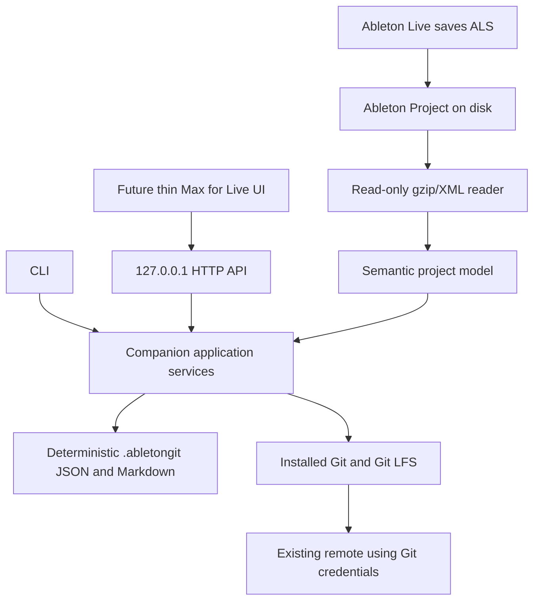

# Architecture

## Projects

- `AbletonGit.Core`: schema, diff model/engine and external IO contracts. No process or HTTP dependencies.
- `AbletonGit.Infrastructure`: project discovery, read-only ALS reader, metadata writer, direct process runner, typed Git adapter and application services. Uses shared-framework logging/DI.
- `AbletonGit.Cli`: musician-facing command/output adapter and Ctrl+C handling. Packaged as the `abletongit` .NET tool.
- `AbletonGit.Api`: minimal API adapter over the same singleton services, fixed project and loopback endpoint.
- `AbletonGit.Tests`: one executable suite spanning core, IO, temporary Git/LFS repositories and real loopback HTTP. Kept together to avoid multiple test projects with no useful dependency boundary.

## Boundaries and failure handling

`IProcessRunner` captures stdout/stderr/exit code, supports input, timeout and cancellation, and kills the process tree when cancelled. Arguments use `ProcessStartInfo.ArgumentList`; no shell executes user descriptions or paths. Git environment redirection is removed. The typed `IGitRepository` has no public arbitrary-command method. Ordinary operations time out after 60 seconds, Push after five minutes. Interactive terminal/credential prompts are disabled; authenticate with normal Git tools first.

The API binds via Kestrel's explicit `IPAddress.Loopback` listener, independent of URL environment overrides. A per-start random token protects all routes; clients use numeric `127.0.0.1`, with no browser origin/fetch headers. No CORS support, credential storage, project-path override or command execution endpoints exist. Unknown JSON Snapshot fields are rejected and request bodies are limited to 4 KiB.

Project write operations acquire an exclusive `.abletongit/operation.lock`, shared across CLI/API processes. Git itself locks its index. Existing staged work is rejected. Files are prepared using NUL-delimited literal pathspecs, protecting spaces, Unicode and wildcard characters. Symlinks/junctions are not traversed, and metadata write targets are checked for reparse points. ALS checksums before/after preparation detect a concurrent Save. This does not lock out arbitrary external Git clients; avoid simultaneous writers.

Analysis writes each report using a temporary file then atomic replacement, skipping identical content. A failure midway can leave reports from different analyses; rerunning Analyse repairs them. A failed commit does not undo or clear the index, because that risks destroying another application's work. See the recovery instructions in [Snapshot workflow](snapshot-workflow.md).

## Evolution

Future live awareness belongs in a separate integration adapter. GitHub-specific repository linking/creation belongs outside Git process logic and must default to private. Restore requires a backup/current Snapshot first and is intentionally absent. Cache, multiple per-Set metadata models, parameter/note diffs and richer macro mappings should follow real-fixture validation rather than guesses about XML.
